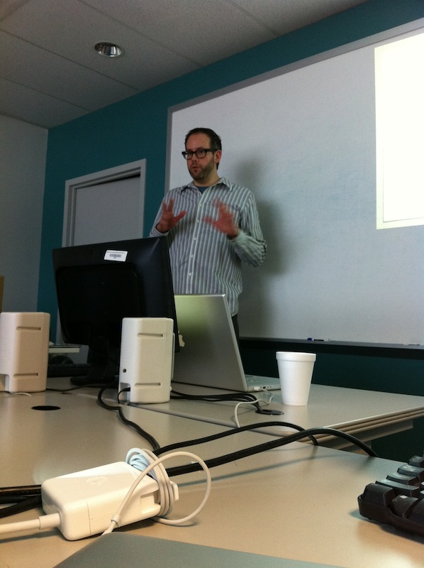

!SLIDE 
Knowlogy Weeklong TDD Training
==============================

!SLIDE center

!SLIDE bullets
Ceedling
========
* Unity
* CMock
* CException

!SLIDE code smaller
Unity
=====
    @@@ C
    #include "unity.h"

    void setUp(void) {}
    void tearDown(void) {}

    void test_NumberValidator_IsNumber_DoesNotAcceptBlankString(void) {}

    void test_NumberValidator_IsNumber_AcceptsZero(void) {}

!SLIDE bullets incremental
Assertions
==========
* `TEST_ASSERT`
* `TEST_ASSERT_FALSE`
* `TEST_ASSERT_EQUAL`

!SLIDE smaller

    @@@ C
    void test_NumberValidator_IsNumber_AcceptsNegativeIntegers(void)
    {
      TEST_ASSERT(NumberValidator_IsNumber("-5"));
      TEST_ASSERT(NumberValidator_IsNumber("-5555"));
      TEST_ASSERT(NumberValidator_IsNumber("-93899393"));
    }

!SLIDE smaller

    @@@ C
    void test_NumberValidator_IsNumber_DoesNotAcceptNonNumbers(void)
    {
      TEST_ASSERT_FALSE(NumberValidator_IsNumber("-"));
      TEST_ASSERT_FALSE(NumberValidator_IsNumber(" -a"));
      TEST_ASSERT_FALSE(NumberValidator_IsNumber("abc"));
      TEST_ASSERT_FALSE(NumberValidator_IsNumber("a"));
      TEST_ASSERT_FALSE(NumberValidator_IsNumber("100%"));
    }

!SLIDE bullets
CMock
=====
* follows convention to generate mock files from a header

!SLIDE small
CMock
=====
    @@@ C
    #include "ApplicationPresenter.h"
    #include "mock_ApplicationModel.h"
    #include "mock_ApplicationView.h"

    void test_ApplicationPresenter_ShowsErrorWhenBadArgs() {
      ApplicationView_GetDivisor_ExpectAndReturn("21");
      ApplicationView_GetDividend_ExpectAndReturn("0");
      ApplicationModel_ValidateArguments
                      _ExpectAndReturn("21", "0", FALSE);
      ApplicationView_ShowError_Expect();

      ApplicationPresenter_CalculateClickedCallback();
    }

!SLIDE bullets incremental
Linkage
=======
* tests are linked against real source, mock dependence
* source is linked against real dependence

!SLIDE
insert image here

!SLIDE bullets
CException
==========
* exception handling implemented with setjmp and longjmp

!SLIDE bullets incremental
Ceedling
========
* compile source
* generate mocks
* compile tests
* run tests
